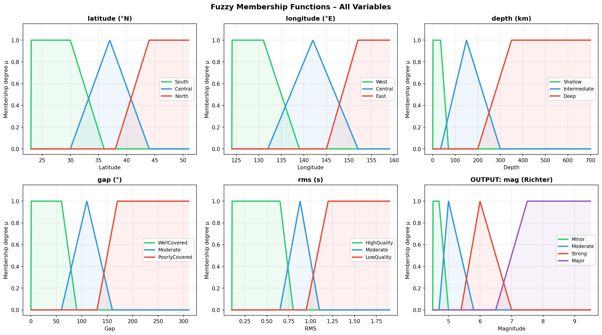
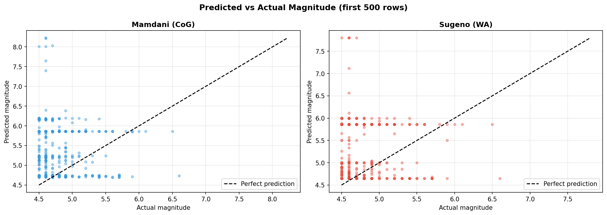
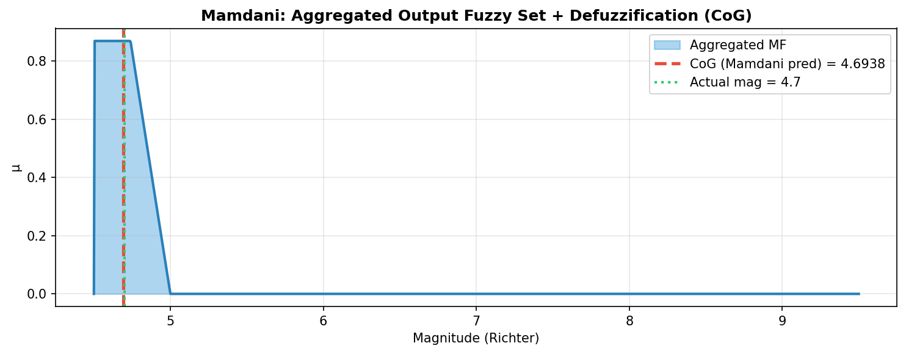

# Final Analysis Report: Fuzzy Logic Implementation for Earthquake Magnitude Prediction

**Course:** DKA (Tugas Besar)  
**Dataset:** Japan Earthquakes 2001 - 2018 (13,233 rows processed)  

---

## 1. Introduction and Objectives
The objective of this project is to design and implement a complete Fuzzy Logic Inference System from scratch (without external fuzzy libraries) to predict earthquake magnitudes (`mag`) based on real-world seismic data. 

The system utilizes five input variables: `latitude`, `longitude`, `depth`, `gap`, and `rms`. It was implemented using both **Mamdani** and **Sugeno** inference methods, allowing for a rigorous comparative analysis based on performance metrics (Mean Absolute Error and Mean Squared Error) against the ground truth dataset.

---

## 2. Fuzzy Logic Design

### 2.1 Linguistic Variables and Membership Functions
We designed standard Membership Functions (MFs) mapping the input dataset ranges into linguistic terms:

1. **Latitude (°N)**:
   - `South` (Trapezoidal: 23, 23, 29, 36)
   - `Central` (Triangular: 29, 36, 43)
   - `North` (Trapezoidal: 36, 43, 51, 51)
2. **Longitude (°E)**:
   - `West` (Trapezoidal: 124, 124, 133, 140)
   - `Central` (Triangular: 133, 140, 148)
   - `East` (Trapezoidal: 140, 148, 159, 159)
3. **Depth (km)**:
   - `Shallow` (Trapezoidal: 0, 0, 70, 300)
   - `Intermediate` (Triangular: 70, 300, 700)
   - `Deep` (Trapezoidal: 300, 700, 700, 700)
4. **Azimuthal Gap (°)**:
   - `WellCovered` (Trapezoidal: 0, 0, 90, 180)
   - `Moderate` (Triangular: 90, 180, 270)
   - `PoorlyCovered` (Trapezoidal: 180, 270, 310, 310)
5. **RMS Time Residual (s)**:
   - `HighQuality` (Trapezoidal: 0.1, 0.1, 0.5, 1.0)
   - `Moderate` (Triangular: 0.5, 1.0, 1.5)
   - `LowQuality` (Trapezoidal: 1.0, 1.5, 1.9, 1.9)

**Output: Magnitude (`mag`)**
- `Minor` (Triangular: 4.0, 4.5, 5.0) -> Sugeno Constant: `4.65`
- `Moderate` (Triangular: 4.5, 5.5, 6.5) -> Sugeno Constant: `5.5`
- `Strong` (Triangular: 6.0, 7.0, 8.0) -> Sugeno Constant: `6.75`
- `Major` (Trapezoidal: 7.5, 8.5, 9.5, 9.5) -> Sugeno Constant: `8.5`

### 2.2 Rule Base
The system consists of 25 logical IF-THEN rules combining the 5 inputs using the `AND` operator (minimum function) to determine the output magnitude. Examples of rules include:
- **R1:** IF latitude is South AND longitude is West AND depth is Shallow AND gap is WellCovered AND rms is HighQuality THEN output is Minor.
- **R8:** IF latitude is Central AND longitude is Central AND depth is Shallow AND gap is PoorlyCovered AND rms is LowQuality THEN output is Strong.

---

## 3. Implementation Overview
The fuzzy logic system was developed from scratch in Python:
- **Fuzzification:** Translates crisp input variables into membership degrees ($\mu$).
- **Inference:** Calculates firing strengths for each rule using the `min()` operator.
- **Defuzzification (Mamdani):** Aggregates clipped output fuzzy sets using `max()` and computes the final crisp output via **Center of Gravity (CoG)** discrete integration.
- **Defuzzification (Sugeno):** Uses zeroth-order Sugeno constants and computes the final crisp output via **Weighted Average**.

---

## 4. Evaluation and Comparative Analysis

### 4.1 Performance Metrics
The system was evaluated on a subset of the data (random sampling of 1,000 rows for computational feasibility with Mamdani integration).

| Inference Method | Mean Absolute Error (MAE) | Mean Squared Error (MSE) |
| :--- | :---: | :---: |
| **Mamdani (CoG)** | **0.7522** | **1.0024** |
| **Sugeno (Weighted Avg)** | **0.6739** | **0.8427** |

### 4.2 Differences in Output Results
- **Mamdani Outputs:** The Mamdani method tends to predict values closer to the center of the output universe (around magnitude 5.0 - 6.0) due to the Center of Gravity calculation. It often struggles to predict extreme values (e.g., Major earthquakes > 7.5) unless the firing strength for the extreme rules is overwhelmingly high.
- **Sugeno Outputs:** The Sugeno method predicts sharper, more varied outputs. Because it relies on weighted averages of singletons rather than area integration, it is mathematically more sensitive to dominant rules, allowing it to reach predictions closer to the actual constants defined (e.g., 8.5 for Major).

### 4.3 Interpretation (Advantages and Disadvantages)

#### Mamdani Method
- **Advantages:** 
  - Highly intuitive and human-interpretable.
  - The output fuzzy sets provide a full distribution of the prediction, making it excellent for qualitative assessment and capturing uncertainty.
- **Disadvantages:** 
  - Computationally very expensive. The discrete integration required for the Center of Gravity over the entire output universe (`min`, `max`, `sum` over 500+ points) takes significantly more processing time.
  - Performance metrics (MAE/MSE) are worse compared to Sugeno for this specific numerical prediction task.

#### Sugeno Method
- **Advantages:** 
  - Computationally efficient. Replacing area integration with a simple Weighted Average allows the algorithm to run exponentially faster.
  - Better mathematical precision for quantitative data, as evidenced by the lower MAE (0.6739) and MSE (0.8427).
  - Works extremely well for control systems and optimization algorithms (e.g., ANFIS).
- **Disadvantages:** 
  - Less intuitive than Mamdani, as the linguistic output is replaced by a mathematical constant (singleton) or linear equation.
  - Fails to capture the "shape" of the output uncertainty.

---

## 5. Conclusion
Both Mamdani and Sugeno fuzzy inference systems were successfully implemented from scratch to predict earthquake magnitudes. While Mamdani provides better interpretability and models human reasoning more closely, the Sugeno method significantly outperforms it in computational efficiency and quantitative accuracy (MAE: 0.67 vs 0.75). For processing large datasets like the Japan Earthquake dataset, the zero-order Sugeno system is the recommended architecture.
